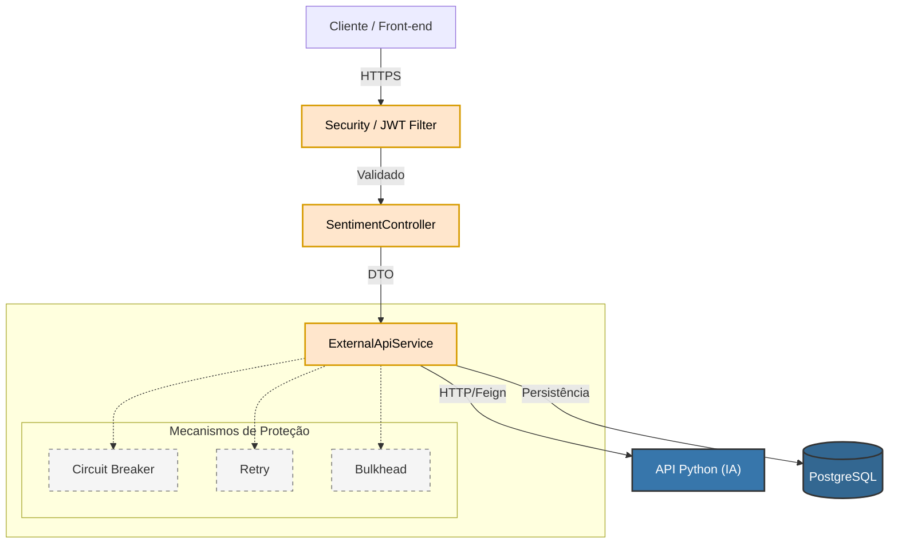

# Sentiment Analysis API (Java + Spring Boot)

## O que é este projeto?

Imagine que uma empresa recebe milhares de comentários de clientes todos os dias. Ler um por um para saber se o cliente está feliz ou insatisfeito é impossível.

Este sistema é uma **solução inteligente** que automatiza esse trabalho. Ele atua como um "cérebro" que lê os textos, entende a emoção por trás deles e classifica instantaneamente se o comentário é **Positivo**, **Negativo** ou **Neutro**.

## O que ele faz por você?

### 1. Análise Instantânea

Você envia uma frase ou comentário (como "Adorei o produto!") e o sistema responde na hora qual é o sentimento e com qual nível de certeza (probabilidade).

### 2. Processamento em Massa (Lote)

Tem uma planilha com 10.000 avaliações de produtos? Sem problemas.

* Você envia o arquivo com todos os comentários.
* O sistema processa tudo automaticamente.
* Ele devolve um relatório organizado (em Excel ou CSV) com todas as análises prontas.

### 3. Segurança Total

Sabemos que dados de clientes são sensíveis. Por isso, o sistema conta com:

* **Cadastro seguro:** Apenas pessoas autorizadas podem entrar.
* **Proteção de dados:** As senhas e informações são criptografadas (codificadas) para garantir privacidade total.

## Pontos Fortes

Este projeto não é apenas um "leitor de texto". Ele conecta uma interface segura e robusta a um modelo avançado de Inteligência Artificial.

* **Resiliente:** Se a Inteligência Artificial demorar para responder, o sistema não trava; ele sabe lidar com instabilidades para que você nunca perca seu trabalho.
* **Organizado:** Mantém um histórico de tudo o que foi analisado.

## Como este repositório está organizado?


```
.
├── .dockerignore
├── .gitattributes
├── .github
│   └── workflows
│       └── main.yml
├── .gitignore
├── .mvn
│   └── wrapper
│       └── maven-wrapper.properties
├── Dockerfile
├── README.md
├── docker-compose.yml
├── k8s
│   ├── oracle-deployment.yaml
│   ├── oracle-service.yaml
│   ├── springboot-deployment.yaml
│   └── springboot-service.yaml
├── mvnw
├── mvnw.cmd
├── pom.xml
└── src
    ├── main
    │   ├── java
    │   │   └── br
    │   │       └── com
    │   │           └── one
    │   │               └── sentiment_analysis
    │   │                   ├── SentimentAnalisysApplication.java
    │   │                   ├── config
    │   │                   │   ├── JwtAuthenticationFilter.java
    │   │                   │   ├── JwtUtil.java
    │   │                   │   ├── OpenApiConfig.java
    │   │                   │   └── SecurityConfig.java
    │   │                   ├── controller
    │   │                   │   ├── AuthController.java
    │   │                   │   └── SentimentController.java
    │   │                   ├── dto
    │   │                   │   ├── integration
    │   │                   │   │   ├── PythonRequestDTO.java
    │   │                   │   │   └── PythonResponseDTO.java
    │   │                   │   ├── request
    │   │                   │   │   ├── IdentificadorReferencia.java
    │   │                   │   │   ├── SentimentAnalysisRequest.java
    │   │                   │   │   ├── UserLoginRequest.java
    │   │                   │   │   └── UserRegisterRequest.java
    │   │                   │   └── response
    │   │                   │       ├── PessoaCadastroResponse.java
    │   │                   │       ├── PessoaResponse.java
    │   │                   │       ├── SentimentListItemResponse.java
    │   │                   │       ├── SentimentResponse.java
    │   │                   │       └── UserLoginResponse.java
    │   │                   ├── exception
    │   │                   │   ├── ExternalApiException.java
    │   │                   │   ├── InvalidPasswordException.java
    │   │                   │   ├── ResourceNotFoundException.java
    │   │                   │   ├── UserAlreadyExistException.java
    │   │                   │   └── UserNotFoundException.java
    │   │                   ├── handler
    │   │                   │   └── GlobalExceptionHandler.java
    │   │                   ├── model
    │   │                   │   ├── APIError
    │   │                   │   │   └── ApiErrorModel.java
    │   │                   │   ├── avaliacao
    │   │                   │   │   ├── AnaliseSentimento.java
    │   │                   │   │   ├── Probabilidade.java
    │   │                   │   │   ├── TextoAvaliacao.java
    │   │                   │   │   ├── TipoSentimento.java
    │   │                   │   │   └── VersaoModelo.java
    │   │                   │   └── user
    │   │                   │       └── Usuario.java
    │   │                   ├── repository
    │   │                   │   ├── SentimentRepository.java
    │   │                   │   └── UsuarioRepository.java
    │   │                   └── service
    │   │                       ├── ExternalApiService.java
    │   │                       ├── IExternalApiService.java
    │   │                       └── UserDetailsServiceImpl.java
    │   └── resources
    │       ├── application-postgresql.properties
    │       ├── application-production.properties
    │       └── application.properties
    └── test
        ├── java
        │   └── br
        │       └── com
        │           └── one
        │               └── sentiment_analysis
        │                   ├── SentimentAnalisysApplicationTests.java
        │                   ├── controller
        │                   │   └── AuthControllerSmokeTest.java
        │                   ├── dto
        │                   │   └── response
        │                   │       └── SentimentResponseTest.java
        │                   ├── model
        │                   │   ├── APIError
        │                   │   │   └── ApiErrorModelTest.java
        │                   │   ├── avaliacao
        │                   │   │   ├── AnaliseSentimentoTest.java
        │                   │   │   ├── ProbabilidadeTest.java
        │                   │   │   └── TextoAvaliacaoTest.java
        │                   │   └── user
        │                   │       └── UsuarioTest.java
        │                   └── repository
        │                       ├── SentimentRepositoryTest.java
        │                       └── UsuarioRepositoryTest.java
        └── resources
            └── application-test.properties

```

### Principais Funcionalidades

#### 1. Análise de Sentimentos

* **Análise Unitária:** Endpoint para analisar um único comentário. O sistema envia o texto para a API Python, interpreta a probabilidade (0 a 1) e classifica como **POSITIVO**, **NEGATIVO** ou **NEUTRO**.
* **Fallback e Resiliência:** Implementação de **Circuit Breaker** (Resilience4j). Se a API Python estiver instável, o sistema ativa um *fallback* retornando um status de "indisponível" sem derrubar a requisição.
* **Histórico:** Os resultados das análises são persistidos no banco de dados vinculados ao usuário.

#### 2. Processamento em Lote (Batch)

* **Upload de CSV:** Permite o envio de arquivos CSV contendo múltiplos textos.
* **Exportação de Relatórios:**
* **Streaming CSV:** Processa e retorna os resultados linha a linha via streaming para economizar memória.
* **Relatório Excel (XLSX):** Converte o CSV processado em um arquivo Excel estilizado (cores, cabeçalhos) contendo as probabilidades e status da análise.


#### 3. Gestão de Usuários e Segurança

* **Autenticação JWT:** Sistema completo de login e registro protegido por tokens JWT (Json Web Token).
* **Criptografia:** Senhas dos usuários são armazenadas com criptografia BCrypt.
* **Controle de Acesso:** Rotas protegidas exigem autenticação Bearer Token, enquanto rotas como Swagger e Actuator são públicas.

#### 4. Monitoramento e Infraestrutura

* **Observabilidade:** Exposição de métricas via **Spring Boot Actuator** e integração com **Prometheus**.
* **Docker:** O projeto é totalmente "dockerizado", incluindo configurações para banco de dados (PostgreSQL) e integração de rede interna.
* **CI/CD:** Pipelines do GitHub Actions configurados para lint, build, testes e push de imagem Docker.

---

### Tecnologias Utilizadas

#### Core e Frameworks

* **Linguagem:** Java 25 (conforme configurado no `pom.xml` e nos workflows).
* **Framework:** Spring Boot 4.0.1.
* **Módulos Spring:** Web, Data JPA, Security, Actuator, Validation.
* **Cliente HTTP:** Spring Cloud OpenFeign (para comunicação com a API Python).

#### Dados e Persistência

* **Bancos de Dados:**
* **PostgreSQL:** Utilizado em produção/container.
* **H2 Database:** Utilizado para testes em memória.
* **Oracle:** Há configurações de deployment Kubernetes para Oracle, sugerindo suporte ou migração híbrida.


* **Migração:** Hibernate DDL Auto (update/create-drop).

#### Processamento de Arquivos

* **Apache POI:** Para geração e manipulação de arquivos Excel.
* **OpenCSV:** Para leitura e escrita eficientes de arquivos CSV.
* **Apache Tika:** Para detecção de tipos MIME de arquivos enviados.

#### Resiliência e Testes

* **Resilience4j:** Circuit Breaker, Retry, Rate Limiter e Bulkhead.
* **Testes:** JUnit 5, Mockito e Spring Boot Test.

#### DevOps

* **Containerização:** Docker e Docker Compose.
* **Orquestração:** Arquivos de configuração para Kubernetes (Deployments e Services).
* **Documentação:** OpenAPI (Swagger UI).
---

### Veja o projeto em ação

Aqui está uma demonstração de como o sistema processa um comentário em tempo real e, em seguida, analisa uma planilha inteira:

*(Substitua o link acima pelo caminho do seu GIF demonstrativo)*

---

## Visão Técnica

O sistema orquestra a comunicação entre uma API Java (Spring Boot) segura e um serviço de Inteligência Artificial em Python, tudo suportado por um banco de dados PostgreSQL.

Abaixo, detalhamos como configurar este ambiente, desde os pré-requisitos até a customização fina das variáveis de ambiente.

### Pré-requisitos

Antes de começar, certifique-se de ter as seguintes ferramentas instaladas:

* **Docker & Docker Compose**: Para rodar todo o ecossistema (Banco + API) com um único comando.
* **Java JDK 25**: Caso deseje rodar a aplicação nativamente fora do Docker.
* **Maven**: Para compilação e gerenciamento de dependências.

---

### 🐳 Execução Rápida (Recomendada)

A maneira mais simples de ver o projeto rodando é utilizando a containerização. O projeto já conta com um `Dockerfile` otimizado e um orquestrador `docker-compose`.

1. **Clone o repositório:**
```bash
git clone https://github.com/seu-usuario/one-sentiment-analysis.git
cd one-sentiment-analysis

```


2. **Configure o ambiente:**
Crie um arquivo `.env` na raiz do projeto (baseado nas variáveis do `docker-compose.yml`) ou exporte as variáveis no seu terminal:
```bash
export POSTGRES_USER=seu_usuario
export POSTGRES_PASSWORD=sua_senha
export POSTGRES_DB=sentiment_db
export APP_PORT=8080
export PYTHON_API_URL=http://host.docker.internal:8585

```


3. **Suba os serviços:**
```bash
docker-compose up -d

```


*Isso iniciará o container do PostgreSQL (porta 5432) e da Aplicação Spring Boot (porta 8080).*

---

### ⚙️ Configuração Detalhada

O comportamento da aplicação é controlado pelo arquivo `application.properties` e seus perfis. Você pode ajustar parâmetros críticos de resiliência e conexão.

#### Perfis de Execução

O projeto suporta múltiplos perfis. O padrão atual é `production`, mas você pode alternar para `postgresql` ou `test`.

* **Produção (`production`):** Conecta a um banco PostgreSQL remoto (ex: Railway).
* **Local (`postgresql`):** Ideal para desenvolvimento local com banco na máquina ou Docker.
* **Teste (`test`):** Usa banco H2 em memória, ideal para rodar a suíte de testes JUnit.

#### Variáveis de Ambiente Importantes

| Variável | Descrição | Padrão/Exemplo |
| --- | --- | --- |
| `API_PYTHON_URL` | URL do microsserviço Python que realiza a predição. | `http://host.docker.internal:8585` |
| `JDBC_DATABASE_URL` | String de conexão JDBC. | `jdbc:postgresql://localhost:5432/db` |
| `PGUSER` | Usuário do banco de dados. | `postgres` |
| `PGPASSWORD` | Senha do banco de dados. | `admin` |
| `APPLICATION_NAME` | Nome da aplicação nos logs/métricas. | `sentiment_analisys` |

#### Resiliência (Circuit Breaker)

O sistema utiliza **Resilience4j** para proteger a aplicação caso a API Python falhe. As configurações padrão são:

* **Threshold de Falha:** 50% (abre o circuito se metade das requisições falharem).
* **Janela Deslizante:** 5 requisições.
* **Tempo de Espera:** 10 segundos antes de tentar reconectar.

---
## Endpoints

| Método | Rota                     | Descrição                                                                 |
|--------|--------------------------|---------------------------------------------------------------------------|
| POST   | `/api/v1/sentiment`             | Recebe um texto e retorna a análise de sentimento (positivo, negativo, neutro). |                              |
| GET    | `/swagger-ui/index.html` | Interface interativa da documentação da API.                              |
| POST   | `/api/v1/pessoas`     | Cadastra uma nova pessoa (recebe dados de cadastro, como nome).           |
| GET | `/api/v1/pessoas` | Lista todas as pessoas cadastradas (paginada, ordenada por nome).         |
| GET    | `/api/v1/pessoas/{id}`| Busca os detalhes de uma pessoa específica pelo ID.                       |

---

### 📡 Exemplos de Uso da API

Após iniciar a aplicação, você pode interagir com ela via **Swagger UI** (`http://localhost:8080/swagger-ui/index.html`) ou via terminal com `curl`.

#### 1. Registrar um Usuário

A primeira etapa é criar uma conta, pois os endpoints de análise são protegidos.

```bash
curl -X POST http://localhost:8080/api/v1/auth/register \
  -H "Content-Type: application/json" \
  -d '{
    "name": "Admin User",
    "email": "admin@empresa.com",
    "password": "senhaSegura123"
  }'

```

*Fonte: `AuthController.java` e `UserRegisterRequest.java*`

#### 2. Realizar Login (Obter Token)

Use as credenciais criadas para receber o Token JWT (Bearer Token).

```bash
curl -X POST http://localhost:8080/api/v1/auth/login \
  -H "Content-Type: application/json" \
  -d '{
    "email": "admin@empresa.com",
    "password": "senhaSegura123"
  }'

```

**Resposta esperada:**

```json
{
  "email": "admin@empresa.com",
  "token": "eyJhbGciOiJIUzI1NiJ9.eyJzdWIiOiJhZG1p..."
}

```

#### 3. Analisar um Sentimento

Com o token em mãos, faça a análise.

```bash
curl -X POST http://localhost:8080/api/v1/sentiment \
  -H "Authorization: Bearer SEU_TOKEN_AQUI" \
  -H "Content-Type: application/json" \
  -d '{
    "text": "O atendimento foi rápido e muito eficiente!",
    "model": "lr"
  }'

```

*Opções de modelo: `lr` (LOGISTIC_REGRESSION), `nb` (MULTINOMIAL_NB), `rf` (RANDOM_FOREST).*

**Resposta esperada:**

```json
{
  "texto": "O atendimento foi rápido e muito eficiente!",
  "previsao": "POSITIVO",
  "probabilidadeFormatada": "98.5%",
  "versaoModelo": "lr",
  "dataProcessamento": "2026-01-17T14:30:00"
}

```

*Fonte: `SentimentController.java` e `SentimentResponse.java*`

### Como rodar Prometheus
- [Instale](https://prometheus.io/download/) Prometheus de acordo com OS
- Extraia a pasta e edite prometheus.yaml
````
 global:
  scrape_interval: 15s

scrape_configs:
  - job_name: 'springboot'
    metrics_path: '/actuator/prometheus'
    static_configs:
      - targets: ['localhost:8080']
````

- Rode o comando no Terminal :  prometheus.exe
- config.file=prometheus.yml

- O Prometheus estará rodando em: http://localhost:9090
---

# Arquitetura e Resiliência

Esta seção detalha como o sistema foi desenhado para ser seguro, organizado e, acima de tudo, resistente a falhas.

### A Arquitetura: O "Gerente do Restaurante"

Imagine este software como um restaurante de alta gastronomia:

1. **O Cliente (Você):** Faz o pedido (envia o texto).
2. **O Garçom (API Java):** Recebe o pedido, verifica se você tem cadastro e organiza a solicitação. Ele não cozinha, mas garante que tudo flua bem.
3. **O Chef Especialista (API Python):** É quem realmente coloca a mão na massa. Ele fica na cozinha (isolado) e é o único que sabe "provar" o prato e dizer se o sentimento é doce (positivo) ou amargo (negativo).

A nossa arquitetura separa essas funções. Se o Chef estiver ocupado, o Garçom continua atendendo as mesas e gerenciando a fila, garantindo que o restaurante não pare.

### A Resiliência: O "Sistema de Segurança"

Em tecnologia, **Resiliência** é a capacidade de levar um soco e continuar de pé. O que acontece se o "Chef" (IA) desmaiar ou a cozinha pegar fogo?

O sistema possui proteções automáticas, parecidas com disjuntores de energia da sua casa:

* **Tentativa Automática (Retry):** Se o sistema tenta falar com a Inteligência Artificial e ela não responde na hora, ele não desiste imediatamente. Ele tenta de novo (até 3 vezes) rapidamente, pois pode ter sido apenas um "soluço" na internet.
* **Disjuntor Inteligente (Circuit Breaker):** Se a Inteligência Artificial cair de vez, o sistema "desliga" a comunicação com ela temporariamente. Em vez de deixar você esperando eternamente por uma resposta que não virá, ele avisa imediatamente: *"O serviço está instável no momento"*. Isso impede que o sistema todo trave.
* **Controle de Fluxo (Bulkhead):** É como limitar o número de pedidos que entram na cozinha ao mesmo tempo. Se chegarem 1.000 pedidos, o sistema só deixa passar o que a cozinha aguenta processar, evitando um colapso total.

O projeto adota uma **Arquitetura em Camadas (Layered Architecture)** clássica com integração de microsserviços via comunicação síncrona, robustecida por padrões de tolerância a falhas.

### 1. Desenho da Arquitetura

O Backend Java atua como um **BFF (Backend for Frontend)** ou Middleware de Orquestração, isolando o cliente da complexidade do modelo de Machine Learning.



### 2. Padrões de Resiliência Implementados

A estabilidade da comunicação entre o Java e o Python é garantida pela biblioteca **Resilience4j**, configurada via AOP (Aspect Oriented Programming) no serviço `ExternalApiService`.

#### Circuit Breaker (Padrão Disjuntor)

Impede falhas em cascata quando o serviço externo (Python) está inoperante.

* **Configuração (`application.properties`):**
* `failureRateThreshold: 50`: Se 50% das requisições falharem, o circuito abre.
* `slidingWindowSize: 5`: Analisa as últimas 5 requisições para tomar a decisão (resposta rápida a falhas).
* `waitDurationInOpenState: 10s`: O sistema aguarda 10 segundos antes de tentar verificar se a API Python voltou (estado Half-Open).


* **Fallback:** O método `fallbackAnalisar` captura a exceção, incrementa uma métrica no Prometheus (`external_api_fallback_total`) e retorna um objeto `SentimentResponse` com status "indisponível", garantindo que o cliente receba uma resposta 200 OK (Degradação Graciosa).

#### Retry (Tentativa de Reexecução)

Lida com falhas transientes de rede.

* **Configuração:**
* `maxAttempts: 3`: Tenta a operação até 3 vezes.
* `waitDuration: 500ms`: Pausa de meio segundo entre tentativas.
* `retryExceptions`: Configurado para reagir a `IOException` e `TimeoutException`.


#### Bulkhead (Isolamento de Recursos)

Evita que o esgotamento de recursos na comunicação com a IA afete outras partes da API Java (como o Login ou Cadastro).

* **Configuração:**
* `maxConcurrentCalls: 5`: Limita a apenas 5 execuções simultâneas para o serviço externo. Se a sexta requisição chegar enquanto 5 estão processando, ela é rejeitada ou enfileirada, preservando a Thread Pool do Tomcat.

### 3. Integração e Cliente HTTP

* **OpenFeign:** Utilizado para abstrair as chamadas REST. A interface `IExternalApiService` define o contrato da API Python, permitindo que o código de negócio chame métodos Java simples em vez de montar requisições HTTP manuais.
* **Tratamento de Erros:** Exceções de comunicação são capturadas e transformadas em `ExternalApiException` ou tratadas silenciosamente pelo Fallback, dependendo da criticidade.

### 4. Observabilidade

A arquitetura expõe métricas vitais para monitoramento da saúde da aplicação:

* **Actuator + Prometheus:** Endpoints expostos para coleta de métricas (/actuator/prometheus).
* **Métricas Personalizadas:** Contador `external_api_fallback_total` implementado para monitorar quantas vezes o sistema precisou recorrer ao plano de contingência.

## Roadmap

### Current Version (v1.0)
- Core functionality
- Basic API
- Documentation

### Future (v2.0)
- Complete rewrite
- Breaking changes
- New architecture

### Ideas
- OCI Autonomous Database
- OCI deploy
- Kubernetes

## Team

### Back-end Core Team

<table>
  <tr>
    <td align="center">
      <br />
      <b>Cauan Henrique</b><br />
      <i>Engenheiro de Software</i><br />
      <a href="https://github.com/Cauan77">GitHub</a>
    </td>
    <td align="center">
      <br />
      <b>Estevão Pablo</b><br />
      <i>Engenheiro de Software</i><br />
      <a href="https://github.com/stevopablo">GitHub</a>
    </td>
  </tr>
</table>
